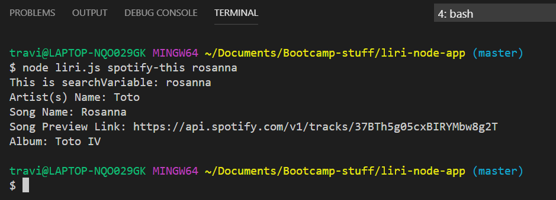
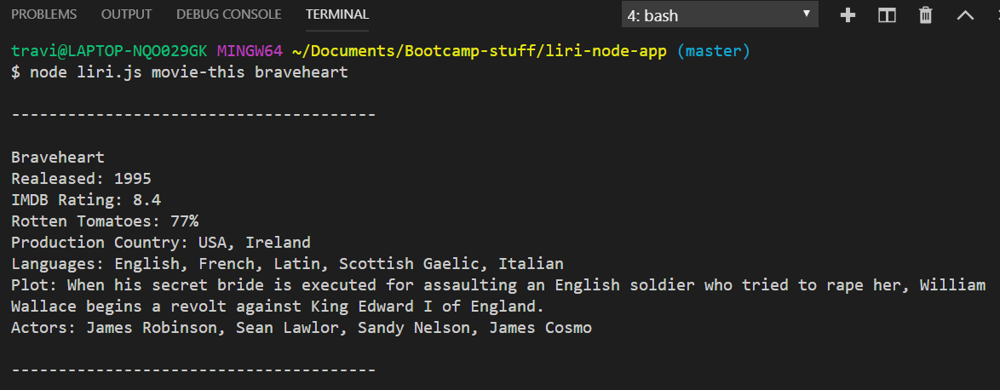

# liri-node-app
Liri is a node.js siri clone that has 3 options pulling from 3 apis.
The app takes in command-line parameters for songs, bands and movies and returns the relevant data.

This app uses the Spotify API, BandsInTown API, and the OMDB API.

To run Liri, you must use the following commands: 'spotify-this', 'concert-this', 'movie-this', or 'do-this'.

Screenshots:

;
;

